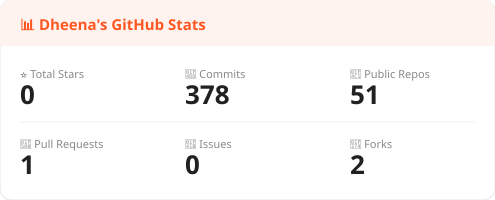
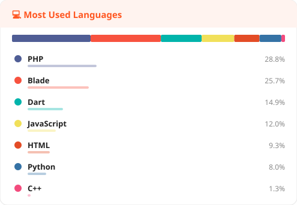

<br/>

<div align="center">

[](https://github.com/DHEENA0007?tab=followers)


<br/><br/>

[](https://git.io/typing-svg)

</div>

<br/>

---

<table>
<tr>
<td width="50%" valign="top">

## 👨‍💻 The Code Behind Me

```python
class Dheena:

    name     = "Dheenadhayalan"
    role     = "Full Stack Developer"
    based_in = "Tamil Nadu, India 🇮🇳"
    speaks   = ["Tamil 🗣️", "English"]

    code     = ["JavaScript", "TypeScript",
                "Python", "PHP", "Dart"]

    mobile   = ["React Native + Expo",
                "Flutter"]

    backend  = ["Django + DRF",
                "Node.js", "REST APIs"]

    db       = ["PostgreSQL", "MySQL",
                "Firebase", "Redis"]

    currently = {
        "building" : "Multicommerce Platform",
        "stack"    : "Django + React Native",
        "status"   : "🔨 Active"
    }

    motto = "Ship real. Solve real."
```

</td>
<td width="50%" valign="top">

## 🏗️ Domains I Build In

```
🛒 Commerce & Retail
   └─ Multicommerce, GST Billing,
      Retail POS, Inventory

🍽️ Food & Hospitality
   └─ Food Hub, Hotel Mgmt,
      Feed Mill

🚗 Transport & Mobility
   └─ Driving School, Car Service,
      Public Transport Tracker

💼 Business Tools
   └─ CRM Systems, Agency Mgmt,
      Billing & Invoicing

💑 Social & Community
   └─ Matrimony, Voter App,
      Civic Service

🤖 AI & Vision
   └─ Friday AI Assistant,
      Camera Vision App
```

</td>
</tr>
</table>

---

## 🔨 What I'm Building Right Now

<div align="center">

```
┌─────────────────────────────────────────────────────────────────┐
│                   🛒  MULTICOMMERCE PLATFORM                    │
│─────────────────────────────────────────────────────────────────│
│                                                                 │
│    🍽️ Food Delivery   🛍️ Ecommerce   🔧 Services               │
│                                                                 │
│    Backend  ──►  Python Django + DRF + Celery + Redis           │
│    Mobile   ──►  React Native + Expo (3 separate apps)          │
│    Admin    ──►  React + Tailwind CSS                           │
│                                                                 │
│    Vendor App · Delivery Partner App · Customer App             │
│                                                                 │
│    Status: 🔨 Active Development                                │
└─────────────────────────────────────────────────────────────────┘
```

</div>

---

## 🛠️ Tech Stack

<div align="center">

### Languages


### Mobile & Frontend


### Backend & Database


### Tools & Platforms


</div>

---

## 📌 Featured Projects

<div align="center">

<table>
<tr>
<td align="center" width="33%">
  <h3>🛒 Multicommerce</h3>
  <p>Food · Ecom · Services on one platform</p>
  
  
  <br/>
  
</td>
<td align="center" width="33%">
  <h3>🤖 <a href="https://github.com/DHEENA0007/friday">Friday AI</a></h3>
  <p>Tony Stark inspired AI assistant</p>
  
  <br/>
  
</td>
<td align="center" width="33%">
  <h3>🧾 <a href="https://github.com/DHEENA0007/Mybill">MyBill</a></h3>
  <p>Billing & invoice management app</p>
  
  <br/>
  
</td>
</tr>
<tr>
<td align="center" width="33%">
  <h3>🚗 <a href="https://github.com/DHEENA0007/car-service">Car Service</a></h3>
  <p>Car service booking mobile app</p>
  
  <br/>
  
</td>
<td align="center" width="33%">
  <h3>📚 <a href="https://github.com/DHEENA0007/E-read">E-Read</a></h3>
  <p>Mobile e-book reader application</p>
  
  <br/>
  
</td>
<td align="center" width="33%">
  <h3>🚌 <a href="https://github.com/DHEENA0007/public_transport">Transit</a></h3>
  <p>Public transport tracker app</p>
  
  <br/>
  
</td>
</tr>
</table>

</div>

---

## 📊 GitHub Stats

<div align="center">



<br/>



</div>

---

## 🐍 Snake Eating My Contributions

<div align="center">
<picture>
  <source media="(prefers-color-scheme: dark)" srcset="https://raw.githubusercontent.com/DHEENA0007/DHEENA0007/output/github-contribution-grid-snake-dark.svg" />
  <source media="(prefers-color-scheme: light)" srcset="https://raw.githubusercontent.com/DHEENA0007/DHEENA0007/output/github-contribution-grid-snake.svg" />
  
</picture>
</div>

---

<div align="center">

### 💬 *"I don't build demos. I build products."*

<br/>


</div>
